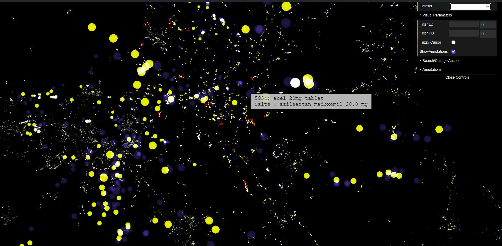
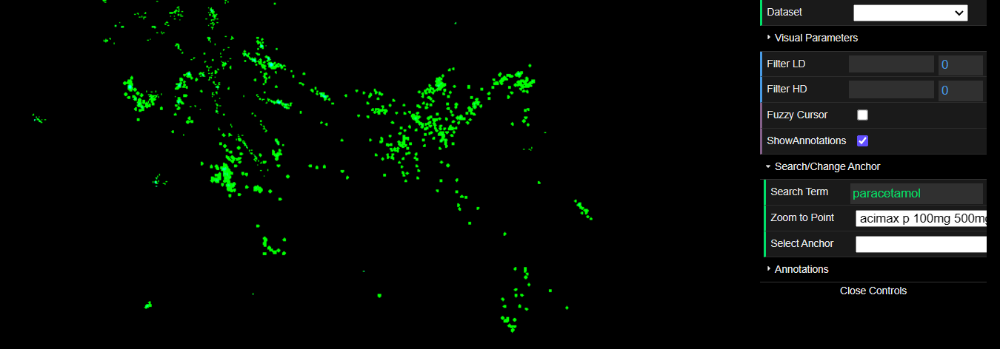
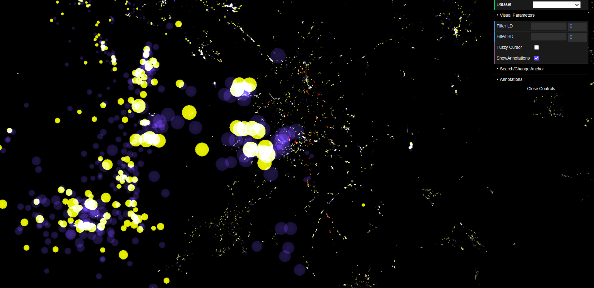
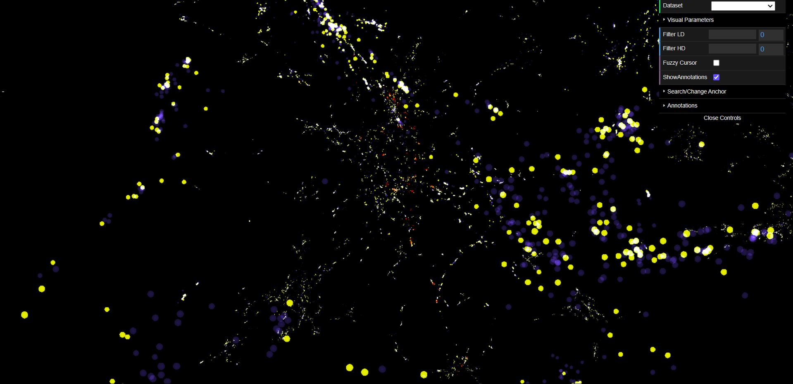
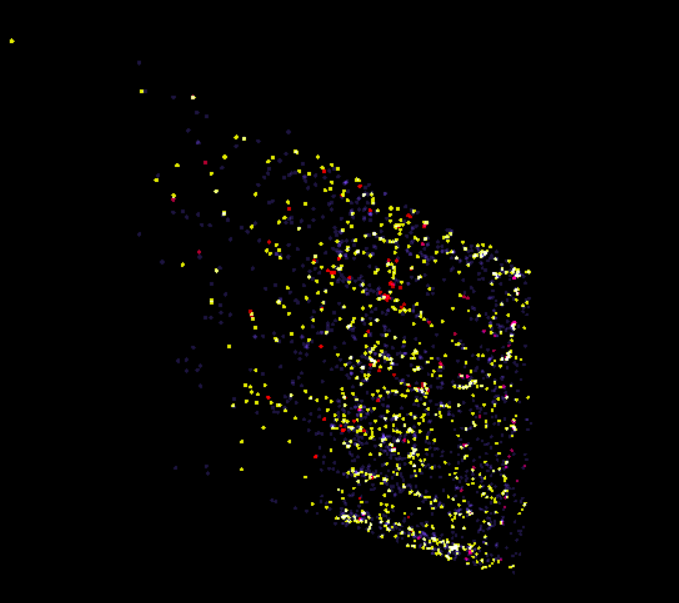

# Mediglot: 3D Medicinal Clustering with Polyphy/Polyglot

  

**Link to app**: [https://ayush-sharma410.github.io/MediGlot/](https://ayush-sharma410.github.io/MediGlot/)    
This project is an extension of the Polyglot app, as developed by [Hongwei (Henry) Zhou](https://normand-1024.github.io) as part of his [master's thesis](https://escholarship.org/uc/item/6zj1r9ch), and is now a part of the PolyPhy toolkit of network-inspired data science tools (for background on the PolyPhy hub, see [here](https://github.com/PolyPhyHub)). The intention behind Polyglot is to give users a hands-on experience going beyond the standard Euclidean measure of similarity and exploring a slime-mold inspired measure of similarity, see below for more details!

Mediglot is a web application for visualizing 3D medicinal embeddings. Medcinal embeddings are  high-dimensional vector representations of the salts present inside a particular medicine. By reducing the dimensionality of these representations to 3D using [UMAP](https://arxiv.org/abs/1802.03426), users are able to explore a 3D point cloud of medicines. Beyond navigating the 3D point cloud, the application also allows users to view the exploration result of the exciting and recent [Monte-Carlo Physarum Machine (MCPM)](https://arxiv.org/abs/2009.02459) metric. The algorithm simulates the self-organizing nature of the _Physarum polycephalum_ slime mold. This particular organism has been shown to discover optimal transport networks on its own, including an instance where it replicated the structure of the [Japanese railway system](https://www.science.org/doi/10.1126/science.1177894). The entire network is thus colored based on its MCPM similarity to the current "anchor point". The anchor point is the point from which all MCPM similarity scores are computed with respect to (e.g., if the anchor point is "dolo", the network is colored such that words with high MCPM similarity to "dolo" are brighter and dissimilar words are darker). 

# Background
For context, Mediglot follows this methodology:
1. We take a diverse dataset of all the popular medicines found on the internet, use an embedding model (such as Word2Vec, BERT, etc.) or an LLM model (such as LLaMa3.1, Gemini, Phi, etc.) to generate a set of high dimensional points associated with each medicine name and it's salts.
2. Use a dimensionality reduction method (such as UMAP or T-SNE) to reduce the dimensionality of each word-vector point to 3 dimensions
3. Use the novel MCPM metric (Monte Carlo Physarum Machine) to compute the similarities between a set of anchor points (in this case medicines selected using quasi random sampling) and the rest of the point cloud.
4. The web app then displays the point cloud of 3-dimensional embeddings of medicines such that the medicines having similar salt compositions can be seen clustered together (for e.g., if we search for a salt named "paracetamol" all the medincines containing "paracetamol" turns green and rest of the medicines dissapears).

# Models
## Gemini-Pro
1. Used Gemini API to get the embeddings for 55,000 unique medicines.
2. Used UMAP to reduce the dimentionality of embeddings to 3.
3. Used the generated embeddings to make clusters of medicines having similar salts and compositions.
4. Calculated the euclidean distances between the points to get the final point cloud.  

## LLaMa3.1 
1. Used LLaMa3.1 to generate the embeddings for 55,000 unique medicines.
2. Used UMAP to reduce the dimentionality of embeddings to 3.
3. Used the generated embeddings to make clusters of medicines having similar salts and compositions.
4. Calculated the euclidean distances between the points to get the final point cloud.  

## Word2Vec
1. Used Word2Vec to generate the embeddings of salts associated with each medicine for a dataset of  55,000 unique medicines.
2. Summed up and normalized the vectors of all the salts associated with each medicine to get the final embeddings for each medicine
2. Used UMAP to reduce the dimentionality of embeddings to 3.
3. Used the generated embeddings to make clusters of medicines having similar salts and compositions.
4. Calculated the euclidean distances between the points to get the final point cloud.  

# Authors
MediGlot is extended as part of [Ayush Sharma's](https://www.linkedin.com/in/ayush-sharma-502256201/) 2024 Google Summer of Code project, mentored by [Oskar Elek](http://elek.pub) and [Kiran Deol](https://www.linkedin.com/in/kiran-deol/).

This web visualization tool was originally created by a team of researchers at University of California, Santa Cruz, Dept. of Computational Media:
- [Hongwei (Henry) Zhou](https://normand-1024.github.io/)
- [Oskar Elek](https://elek.pub/)
- [Angus G. Forbes](https://creativecoding.soe.ucsc.edu/angus/)

This work was published as Hongwei Zhou's [M.S. thesis](https://escholarship.org/uc/item/6zj1r9ch#main).

A version of the original work was published in [2020 IEEE 5th Workshop on Visualization for the Digital Humanities (VIS4DH)](https://www.computer.org/csdl/proceedings-article/vis4dh/2020/915300a007/1pZ0Xs0EEqk)
